# 铁包智能管控系统 - 业务开发系统分析

## 1. 项目概述

### 1.1 项目背景
铁包智能管控系统（ILMS - Iron Ladle Intelligent Management System）是一个基于雷达设备和标识器技术的铁包生命周期管理系统，旨在实现铁包的精准识别、实时追踪和智能化管理。

### 1.2 技术栈
- **前端框架**: Vue 3.2.40 + TypeScript 4.8.4
- **UI 组件库**: Arco Design Vue 2.44.7
- **状态管理**: Pinia 2.0.23
- **路由管理**: Vue Router 4.0.14
- **构建工具**: Vite 3.2.5
- **图表库**: ECharts 5.4.0 + vue-echarts 6.2.3
- **HTTP 客户端**: Axios 0.24.0
- **实时通信**: WebSocket（待集成）
- **工具库**: Lodash 4.17.21、Day.js 1.11.5

### 1.3 系统架构

#### 1.3.1 前端整体架构图

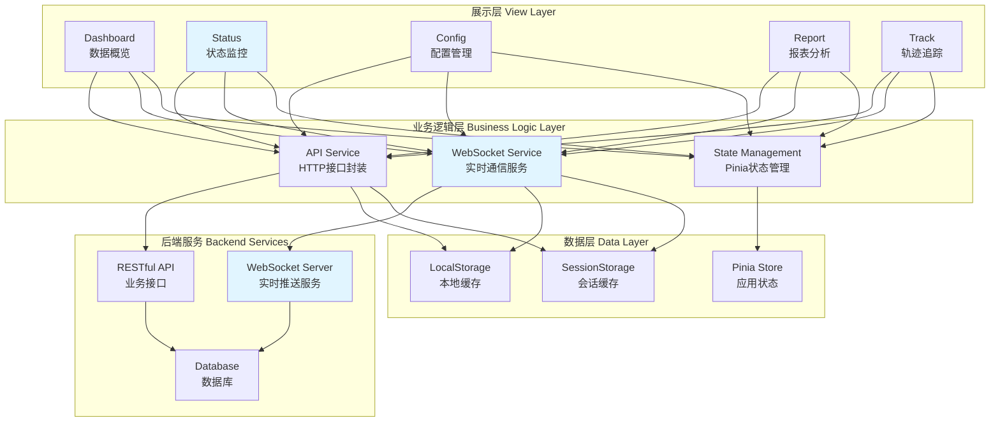

#### 1.3.2 模块架构说明

| 层级 | 模块 | 职责 | 技术栈 |
|------|------|------|--------|
| **展示层** | Dashboard | 数据可视化展示 | Vue 3 + Arco Design + ECharts |
| | Status | 设备状态监控（实时） | Vue 3 + WebSocket |
| | Config | 配置管理界面 | Vue 3 + Form 表单 |
| | Report | 报表统计分析 | Vue 3 + ECharts |
| | Track | 轨迹追踪地图 | Vue 3 + 地图组件 |
| **业务逻辑层** | API Service | HTTP 请求封装 | Axios |
| | WebSocket Service | 实时数据处理 | WebSocket API |
| | State Management | 全局状态管理 | Pinia |
| **数据层** | Pinia Store | 应用状态存储 | Pinia |
| | LocalStorage | 持久化缓存 | Web Storage API |
| | SessionStorage | 会话级缓存 | Web Storage API |

#### 1.3.3 实时通信架构图

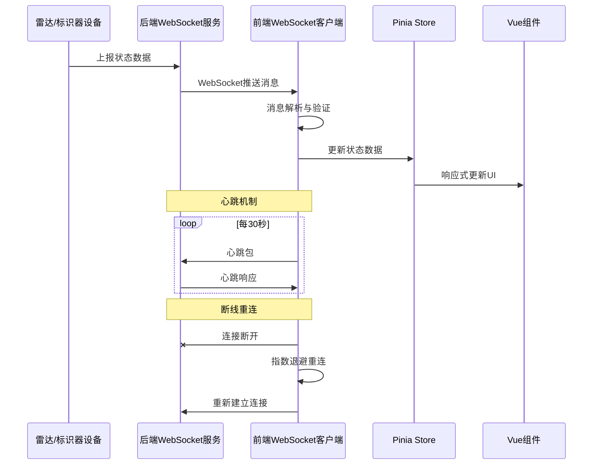

---

## 2. 功能模块详细分析

### 2.0 功能模块关系图

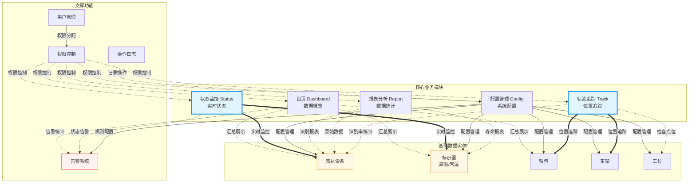

#### 2.0.1 模块关系说明

| 模块 | 依赖实体 | 通信方式 | 核心功能 |
|------|---------|---------|---------|
| **首页** | 雷达、标识器、铁包、告警 | HTTP 轮询 | 数据汇总展示 |
| **状态监控** | 雷达、标识器 | **WebSocket 实时** | 设备状态实时监控 |
| **配置管理** | 雷达、标识器、铁包、车架、工位、告警 | HTTP REST | 配置信息 CRUD |
| **报表分析** | 雷达、标识器 | HTTP REST | 历史数据统计分析 |
| **轨迹追踪** | 铁包、车架、雷达、工位 | **WebSocket + HTTP** | 位置追踪与轨迹回放 |

#### 2.0.2 数据流向说明

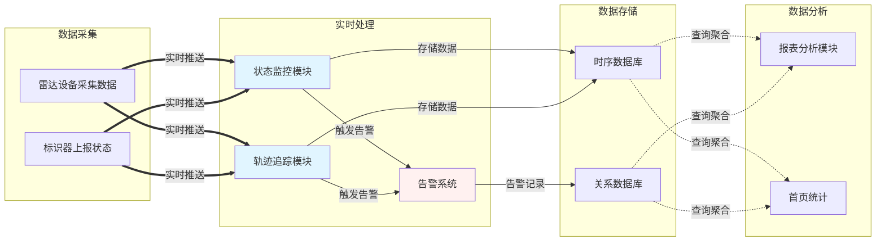

### 2.1 首页（Dashboard）- 数据概览

#### 2.1.1 功能描述
首页提供系统整体运行状态的可视化展示，包括关键指标统计、实时告警信息和设备运行状态汇总。

#### 2.1.2 数据需求
- **设备统计数据**
  - 雷达设备总数、在线数量、离线数量
  - 标识器总数、高温标识器数量、常温标识器数量
  - 铁包总数、在线铁包数量

- **实时告警数据**
  - 最近 24 小时告警统计
  - 告警等级分布（严重、警告、提示）
  - 未处理告警数量

- **业务指标**
  - 今日识别次数
  - 识别成功率
  - 设备运行时长统计

#### 2.1.3 接口设计
```typescript
// GET /api/dashboard/overview
interface DashboardOverview {
  deviceStats: {
    radarTotal: number;
    radarOnline: number;
    radarOffline: number;
    identifierTotal: number;
    identifierHighTemp: number;
    identifierNormalTemp: number;
    ladleTotal: number;
    ladleOnline: number;
  };
  alarmStats: {
    total: number;
    critical: number;
    warning: number;
    info: number;
    unhandled: number;
  };
  businessStats: {
    todayRecognitions: number;
    recognitionRate: number;
    avgResponseTime: number;
  };
}

// GET /api/dashboard/charts
interface DashboardCharts {
  recognitionTrend: Array<{ time: string; count: number }>; // 识别趋势
  deviceStatusTrend: Array<{ time: string; online: number; offline: number }>; // 设备状态趋势
  alarmTrend: Array<{ time: string; critical: number; warning: number; info: number }>; // 告警趋势
}
```

#### 2.1.4 技术方案
- **通信方式**: HTTP RESTful API
- **刷新策略**: 定时轮询（30秒间隔）
- **图表实现**: ECharts 折线图、柱状图、饼图
- **性能优化**: 使用 `requestAnimationFrame` 控制刷新频率

---

### 2.2 状态监控模块（Status）

#### 2.2.1 雷达设备状态

##### 功能描述
实时监控所有雷达设备的运行状态，包括设备在线状态、信号强度、识别精度等关键指标。

##### 数据需求（实时性要求高）
- 设备列表及实时状态
- 设备 IP、端口、位置信息
- 信号强度、识别次数、错误率
- 最后心跳时间、最后识别时间

##### 接口设计
```typescript
// WebSocket 连接
// ws://api-host/ws/radar-status

// WebSocket 消息格式
interface RadarStatusMessage {
  type: 'status_update' | 'device_online' | 'device_offline' | 'alarm';
  timestamp: number;
  data: {
    deviceId: string;
    deviceName: string;
    status: 'online' | 'offline' | 'warning' | 'error';
    ip: string;
    port: number;
    location: string;
    signalStrength: number; // 0-100
    recognitionCount: number;
    errorRate: number; // 0-1
    lastHeartbeat: number;
    lastRecognition: number;
    temperature?: number;
    voltage?: number;
  };
}

// HTTP 备用接口（WebSocket 不可用时）
// GET /api/status/radar-devices
interface RadarDeviceListResponse {
  total: number;
  list: RadarDeviceStatus[];
}

// POST /api/status/radar-device/restart
// 重启设备
interface RestartDeviceRequest {
  deviceId: string;
}
```

##### 技术方案
- **主要通信方式**: WebSocket（实时推送）
- **备用方案**: HTTP 轮询（5秒间隔）
- **心跳检测**: 客户端每 30 秒发送心跳
- **断线重连**: 指数退避策略（1s, 2s, 4s, 8s, 最大 30s）
- **数据缓存**: 保留最近 100 条状态变更记录
- **告警处理**: 设备离线超过 1 分钟触发告警通知

##### WebSocket 服务封装
```typescript
// src/services/websocket/radar-status.ts
class RadarStatusWebSocket {
  private ws: WebSocket | null = null;
  private reconnectTimer: number | null = null;
  private reconnectDelay = 1000;
  private maxReconnectDelay = 30000;
  private heartbeatTimer: number | null = null;

  connect(onMessage: (data: RadarStatusMessage) => void): void;
  disconnect(): void;
  send(data: any): void;
  private setupHeartbeat(): void;
  private handleReconnect(): void;
}
```

#### 2.2.2 标识器状态

##### 功能描述
实时监控高温标识器和常温标识器的运行状态，包括电量、温度、识别次数等信息。

##### 数据需求（实时性要求高）
- 标识器列表及实时状态
- 标识器类型（高温/常温）
- 电量、温度、识别次数
- 所属铁包/车架信息
- 最后识别时间

##### 接口设计
```typescript
// WebSocket 连接
// ws://api-host/ws/identifier-status

// WebSocket 消息格式
interface IdentifierStatusMessage {
  type: 'status_update' | 'low_battery' | 'high_temperature' | 'binding_change';
  timestamp: number;
  data: {
    identifierId: string;
    identifierType: 'high_temp' | 'normal_temp';
    status: 'active' | 'inactive' | 'low_battery' | 'error';
    battery: number; // 0-100
    temperature: number;
    recognitionCount: number;
    bindingType: 'ladle' | 'carriage' | 'none';
    bindingTarget?: string; // 铁包编号或车架编号
    lastRecognition: number;
    signalQuality: number; // 0-100
  };
}

// HTTP 备用接口
// GET /api/status/identifiers
interface IdentifierListResponse {
  total: number;
  list: IdentifierStatus[];
}
```

##### 技术方案
- **主要通信方式**: WebSocket（实时推送）
- **备用方案**: HTTP 轮询（5秒间隔）
- **告警触发条件**:
  - 电量低于 20%
  - 高温标识器温度超过预设阈值
  - 标识器离线超过 5 分钟
- **数据展示**: 分页表格 + 实时状态卡片

---

### 2.3 配置管理模块（Config）

#### 2.3.1 雷达设备配置

##### 功能描述
管理雷达设备的基本信息、网络配置、识别参数等。

##### 数据需求
- 设备基本信息（名称、型号、序列号）
- 网络配置（IP、端口、协议）
- 安装位置（经纬度、高度、朝向）
- 识别参数（识别距离、灵敏度、过滤阈值）
- 告警配置（离线告警、错误率告警）

##### 接口设计
```typescript
// GET /api/config/radar-devices?page=1&pageSize=20
interface RadarDeviceConfigListResponse {
  total: number;
  list: RadarDeviceConfig[];
}

// GET /api/config/radar-device/:id
interface RadarDeviceConfig {
  id: string;
  name: string;
  model: string;
  serialNumber: string;
  ip: string;
  port: number;
  protocol: 'TCP' | 'UDP';
  location: {
    longitude: number;
    latitude: number;
    altitude: number;
    direction: number;
  };
  recognitionParams: {
    maxDistance: number; // 最大识别距离（米）
    sensitivity: number; // 灵敏度 0-100
    filterThreshold: number; // 过滤阈值
  };
  alarmConfig: {
    offlineAlarm: boolean;
    offlineThreshold: number; // 离线告警阈值（秒）
    errorRateAlarm: boolean;
    errorRateThreshold: number; // 错误率告警阈值
  };
  createdAt: number;
  updatedAt: number;
}

// POST /api/config/radar-device
// PUT /api/config/radar-device/:id
interface UpdateRadarDeviceConfigRequest {
  // ... 同 RadarDeviceConfig
}

// DELETE /api/config/radar-device/:id
```

##### 技术方案
- **通信方式**: HTTP RESTful API
- **表单验证**: Arco Design Form + 自定义验证规则
- **操作权限**: 基于角色的权限控制
- **操作日志**: 记录所有配置变更

#### 2.3.2 高温/常温标识器配置

##### 功能描述
管理高温标识器和常温标识器的基本信息、工作参数和告警配置。

##### 数据需求
- 标识器基本信息（编号、类型、序列号）
- 工作参数（工作温度范围、发射功率）
- 电量告警阈值
- 温度告警阈值
- 绑定信息（铁包/车架）

##### 接口设计
```typescript
// GET /api/config/identifiers?type=high_temp&page=1&pageSize=20
interface IdentifierConfigListResponse {
  total: number;
  list: IdentifierConfig[];
}

// GET /api/config/identifier/:id
interface IdentifierConfig {
  id: string;
  code: string; // 标识器编号
  type: 'high_temp' | 'normal_temp';
  serialNumber: string;
  workParams: {
    minTemperature: number;
    maxTemperature: number;
    transmitPower: number; // 发射功率（dBm）
    transmitInterval: number; // 发射间隔（秒）
  };
  alarmConfig: {
    batteryLowThreshold: number; // 低电量告警阈值
    highTemperatureThreshold?: number; // 高温告警阈值（仅高温标识器）
  };
  bindingInfo?: {
    type: 'ladle' | 'carriage';
    targetId: string;
    targetName: string;
    bindTime: number;
  };
  createdAt: number;
  updatedAt: number;
}

// POST /api/config/identifier/:id/bind
// 绑定标识器到铁包或车架
interface BindIdentifierRequest {
  targetType: 'ladle' | 'carriage';
  targetId: string;
}

// POST /api/config/identifier/:id/unbind
// 解绑标识器
```

##### 技术方案
- **通信方式**: HTTP RESTful API
- **批量操作**: 支持批量导入、导出、删除
- **绑定管理**: 可视化绑定关系图

#### 2.3.3 工位列表

##### 功能描述
管理工厂内的工位信息，包括工位位置、类型、关联的雷达设备等。

##### 数据需求
- 工位基本信息（编号、名称、类型）
- 工位位置（经纬度、所属区域）
- 关联设备（雷达设备列表）
- 工艺参数（停留时间阈值、温度要求）

##### 接口设计
```typescript
// GET /api/config/stations?page=1&pageSize=20
interface StationListResponse {
  total: number;
  list: StationConfig[];
}

interface StationConfig {
  id: string;
  code: string; // 工位编号
  name: string;
  type: 'loading' | 'unloading' | 'inspection' | 'maintenance' | 'storage';
  location: {
    longitude: number;
    latitude: number;
    area: string; // 所属区域
  };
  relatedRadars: Array<{
    radarId: string;
    radarName: string;
  }>;
  processParams: {
    minStayTime: number; // 最小停留时间（秒）
    maxStayTime: number; // 最大停留时间（秒）
    temperatureRequirement?: {
      min: number;
      max: number;
    };
  };
  createdAt: number;
  updatedAt: number;
}
```

#### 2.3.4 铁包配置

##### 功能描述
管理铁包的基本信息、容量参数、维护记录等。

##### 数据需求
- 铁包基本信息（编号、名称、型号）
- 容量参数（额定容量、最大容量）
- 绑定的标识器信息
- 维护记录（检修时间、更换衬砖）
- 使用统计（累计使用次数、剩余寿命）

##### 接口设计
```typescript
// GET /api/config/ladles?page=1&pageSize=20&status=active
interface LadleListResponse {
  total: number;
  list: LadleConfig[];
}

interface LadleConfig {
  id: string;
  code: string; // 铁包编号
  name: string;
  model: string;
  capacityParams: {
    ratedCapacity: number; // 额定容量（吨）
    maxCapacity: number; // 最大容量（吨）
    weight: number; // 自重（吨）
  };
  identifierBinding?: {
    identifierId: string;
    identifierCode: string;
    bindTime: number;
  };
  maintenanceRecords: Array<{
    recordId: string;
    type: 'inspection' | 'repair' | 'lining_replacement';
    date: number;
    description: string;
    operator: string;
  }>;
  usageStats: {
    totalUsageCount: number;
    currentLifeCycle: number; // 当前周期使用次数
    remainingLife: number; // 预计剩余寿命（次）
    lastUsedTime: number;
  };
  status: 'active' | 'maintenance' | 'retired';
  createdAt: number;
  updatedAt: number;
}

// POST /api/config/ladle/:id/maintenance
// 添加维护记录
interface AddMaintenanceRecordRequest {
  type: 'inspection' | 'repair' | 'lining_replacement';
  description: string;
  attachments?: string[];
}
```

#### 2.3.5 车架配置

##### 功能描述
管理铁包运输车架的基本信息、绑定关系等。

##### 数据需求
- 车架基本信息（编号、名称、类型）
- 载重参数（最大载重）
- 绑定的标识器信息
- 使用统计

##### 接口设计
```typescript
// GET /api/config/carriages?page=1&pageSize=20
interface CarriageListResponse {
  total: number;
  list: CarriageConfig[];
}

interface CarriageConfig {
  id: string;
  code: string; // 车架编号
  name: string;
  type: 'rail' | 'truck';
  maxLoad: number; // 最大载重（吨）
  identifierBinding?: {
    identifierId: string;
    identifierCode: string;
    bindTime: number;
  };
  usageStats: {
    totalTransportCount: number;
    lastUsedTime: number;
  };
  status: 'active' | 'maintenance' | 'retired';
  createdAt: number;
  updatedAt: number;
}
```

#### 2.3.6 报警配置

##### 功能描述
配置系统的报警规则、通知方式、报警等级等。

##### 数据需求
- 报警规则（触发条件、等级）
- 通知方式（短信、邮件、系统通知）
- 通知对象（用户、用户组）
- 报警屏蔽规则

##### 接口设计
```typescript
// GET /api/config/alarms
interface AlarmConfigListResponse {
  total: number;
  list: AlarmRule[];
}

interface AlarmRule {
  id: string;
  name: string;
  category: 'device' | 'business' | 'system';
  level: 'critical' | 'warning' | 'info';
  condition: {
    type: 'device_offline' | 'low_battery' | 'high_temperature' | 'recognition_failure' | 'custom';
    params: Record<string, any>;
    threshold?: number;
    duration?: number; // 持续时间（秒）
  };
  notification: {
    methods: Array<'sms' | 'email' | 'system' | 'webhook'>;
    targets: Array<{
      type: 'user' | 'group';
      id: string;
      name: string;
    }>;
  };
  muteRules?: {
    enabled: boolean;
    timeRanges: Array<{
      start: string; // HH:mm
      end: string; // HH:mm
    }>;
  };
  enabled: boolean;
  createdAt: number;
  updatedAt: number;
}
```

---

### 2.4 报表分析模块（Report）

#### 2.4.1 雷达识别报表

##### 功能描述
统计和分析雷达设备的识别数据，包括识别次数、成功率、时间分布等。

##### 数据需求
- 时间范围内的识别统计
- 按设备、工位、时段的识别分布
- 识别成功率趋势
- 异常识别记录

##### 接口设计
```typescript
// GET /api/report/radar-recognition?startTime=xxx&endTime=xxx&radarId=xxx
interface RadarRecognitionReportResponse {
  summary: {
    totalRecognitions: number;
    successfulRecognitions: number;
    failedRecognitions: number;
    successRate: number;
    avgResponseTime: number;
  };
  deviceDistribution: Array<{
    radarId: string;
    radarName: string;
    recognitionCount: number;
    successRate: number;
  }>;
  timeDistribution: Array<{
    time: string;
    count: number;
    successCount: number;
    failCount: number;
  }>;
  stationDistribution: Array<{
    stationId: string;
    stationName: string;
    recognitionCount: number;
  }>;
  abnormalRecords: Array<{
    recordId: string;
    time: number;
    radarId: string;
    radarName: string;
    reason: string;
  }>;
}

// GET /api/report/radar-recognition/export
// 导出报表（Excel）
```

##### 技术方案
- **通信方式**: HTTP RESTful API
- **图表展示**: ECharts 折线图、柱状图、热力图
- **数据导出**: Excel、PDF 格式
- **筛选条件**: 时间范围、设备、工位、成功/失败

#### 2.4.2 标识器寿命报表

##### 功能描述
统计和分析标识器的使用寿命、电量消耗、更换记录等。

##### 数据需求
- 标识器使用时长统计
- 电量消耗趋势
- 识别次数统计
- 预计剩余寿命
- 更换建议

##### 接口设计
```typescript
// GET /api/report/identifier-lifespan?type=high_temp&startTime=xxx&endTime=xxx
interface IdentifierLifespanReportResponse {
  summary: {
    totalIdentifiers: number;
    avgLifespan: number; // 平均寿命（天）
    replacedCount: number;
    needReplacementCount: number;
  };
  lifespanDistribution: Array<{
    identifierId: string;
    identifierCode: string;
    type: 'high_temp' | 'normal_temp';
    usedDays: number;
    recognitionCount: number;
    currentBattery: number;
    estimatedRemainingDays: number;
    replacementSuggestion: 'urgent' | 'soon' | 'normal';
  }>;
  batteryTrend: Array<{
    time: string;
    avgBattery: number;
    minBattery: number;
  }>;
  replacementHistory: Array<{
    identifierId: string;
    identifierCode: string;
    replacementTime: number;
    reason: string;
    usedDays: number;
  }>;
}
```

##### 技术方案
- **通信方式**: HTTP RESTful API
- **预测算法**: 基于历史数据的线性回归预测
- **告警提示**: 寿命低于阈值时提示更换

#### 2.4.3 雷达识别原始数据表

##### 功能描述
展示雷达设备的原始识别数据，用于问题排查和数据分析。

##### 数据需求
- 原始识别记录
- 识别时间、设备、目标、信号强度
- 识别结果、置信度
- 可按多维度筛选和导出

##### 接口设计
```typescript
// GET /api/report/raw-data?page=1&pageSize=50&startTime=xxx&endTime=xxx&radarId=xxx
interface RawDataReportResponse {
  total: number;
  list: Array<{
    recordId: string;
    timestamp: number;
    radarId: string;
    radarName: string;
    targetType: 'ladle' | 'carriage' | 'unknown';
    targetId?: string;
    targetCode?: string;
    signalStrength: number;
    distance: number;
    confidence: number; // 置信度 0-100
    result: 'success' | 'failed' | 'ignored';
    rawData: {
      frequency: number;
      amplitude: number;
      phase: number;
    };
  }>;
}

// GET /api/report/raw-data/export
// 导出原始数据（CSV）
```

##### 技术方案
- **通信方式**: HTTP RESTful API
- **分页加载**: 虚拟滚动，支持大数据量展示
- **高级筛选**: 支持多条件组合筛选
- **数据导出**: CSV 格式，支持百万级数据导出

---

### 2.5 轨迹追踪模块（Track）

#### 2.5.1 铁包及车架轨迹

##### 功能描述
实时追踪铁包和车架的位置和移动轨迹，支持历史轨迹回放。

##### 数据需求
- 当前位置信息
- 历史轨迹数据
- 停留工位信息
- 移动速度、方向
- 异常轨迹告警

##### 接口设计
```typescript
// GET /api/track/current?targetType=ladle&targetId=xxx
interface CurrentTrackResponse {
  targetId: string;
  targetCode: string;
  targetType: 'ladle' | 'carriage';
  currentLocation: {
    longitude: number;
    latitude: number;
    stationId?: string;
    stationName?: string;
  };
  status: 'moving' | 'stopped' | 'loading' | 'unloading';
  speed: number; // 速度（m/s）
  direction: number; // 方向（度）
  lastUpdateTime: number;
}

// GET /api/track/history?targetType=ladle&targetId=xxx&startTime=xxx&endTime=xxx
interface HistoryTrackResponse {
  targetId: string;
  targetCode: string;
  targetType: 'ladle' | 'carriage';
  trackPoints: Array<{
    timestamp: number;
    longitude: number;
    latitude: number;
    stationId?: string;
    stationName?: string;
    status: 'moving' | 'stopped' | 'loading' | 'unloading';
    recognitionRecord?: {
      radarId: string;
      radarName: string;
      signalStrength: number;
    };
  }>;
  stayRecords: Array<{
    stationId: string;
    stationName: string;
    arrivalTime: number;
    departureTime: number;
    stayDuration: number; // 停留时长（秒）
  }>;
}
```

##### 技术方案
- **通信方式**: HTTP RESTful API（历史数据）+ WebSocket（实时位置）
- **地图展示**: 使用第三方地图组件（高德地图/百度地图）
- **轨迹回放**: 支持时间轴控制、播放速度调节
- **路径优化**: 轨迹点抽样和平滑处理

#### 2.5.2 检查点位

##### 功能描述
管理和查看关键检查点位的通过记录，用于工艺流程监控。

##### 数据需求
- 检查点位配置
- 通过记录（时间、目标）
- 通过率统计
- 异常通过告警

##### 接口设计
```typescript
// GET /api/track/checkpoints
interface CheckpointListResponse {
  total: number;
  list: Array<{
    checkpointId: string;
    checkpointName: string;
    location: {
      longitude: number;
      latitude: number;
    };
    type: 'entry' | 'exit' | 'inspection' | 'control';
    relatedStation?: string;
    enabled: boolean;
  }>;
}

// GET /api/track/checkpoint/:id/records?startTime=xxx&endTime=xxx&page=1&pageSize=20
interface CheckpointRecordsResponse {
  total: number;
  statistics: {
    totalPasses: number;
    normalPasses: number;
    abnormalPasses: number;
  };
  list: Array<{
    recordId: string;
    passTime: number;
    targetType: 'ladle' | 'carriage';
    targetId: string;
    targetCode: string;
    direction: 'in' | 'out';
    status: 'normal' | 'abnormal';
    radarId: string;
    radarName: string;
  }>;
}
```

##### 技术方案
- **通信方式**: HTTP RESTful API
- **实时告警**: 异常通过立即推送通知
- **统计分析**: 按时段、目标类型统计通过率

#### 2.5.3 识别率

##### 功能描述
统计和分析各个检查点位、工位的识别率，评估系统性能。

##### 数据需求
- 各雷达设备的识别率
- 各工位的识别率
- 识别率趋势分析
- 低识别率告警

##### 接口设计
```typescript
// GET /api/track/recognition-rate?startTime=xxx&endTime=xxx&dimension=radar
interface RecognitionRateResponse {
  summary: {
    overallRecognitionRate: number;
    avgResponseTime: number;
    bestPerformer: {
      id: string;
      name: string;
      rate: number;
    };
    worstPerformer: {
      id: string;
      name: string;
      rate: number;
    };
  };
  radarRates: Array<{
    radarId: string;
    radarName: string;
    totalAttempts: number;
    successfulRecognitions: number;
    recognitionRate: number;
    avgSignalStrength: number;
    trend: 'up' | 'down' | 'stable';
  }>;
  stationRates: Array<{
    stationId: string;
    stationName: string;
    totalAttempts: number;
    successfulRecognitions: number;
    recognitionRate: number;
  }>;
  timeTrend: Array<{
    time: string;
    recognitionRate: number;
    attemptCount: number;
  }>;
}
```

##### 技术方案
- **通信方式**: HTTP RESTful API
- **数据分析**: 计算移动平均识别率
- **趋势预测**: 基于历史数据预测未来趋势
- **告警触发**: 识别率低于阈值时自动告警

---

## 3. 实时通信方案（WebSocket）

### 3.1 WebSocket 架构设计

#### 3.1.1 连接管理
```typescript
// src/services/websocket/websocket-manager.ts
class WebSocketManager {
  private connections: Map<string, WebSocketConnection> = new Map();

  // 创建连接
  createConnection(
    name: string,
    url: string,
    options?: WebSocketOptions
  ): WebSocketConnection;

  // 获取连接
  getConnection(name: string): WebSocketConnection | undefined;

  // 关闭连接
  closeConnection(name: string): void;

  // 关闭所有连接
  closeAll(): void;
}
```

#### 3.1.2 消息协议
```typescript
// 客户端发送的消息格式
interface ClientMessage {
  type: 'subscribe' | 'unsubscribe' | 'heartbeat' | 'command';
  payload: any;
  timestamp: number;
  requestId?: string;
}

// 服务端推送的消息格式
interface ServerMessage {
  type: 'data' | 'error' | 'heartbeat' | 'notification';
  channel?: string; // 数据通道
  payload: any;
  timestamp: number;
  requestId?: string;
}
```

#### 3.1.3 心跳机制
```typescript
class HeartbeatManager {
  private interval = 30000; // 30秒
  private timeout = 10000; // 10秒超时
  private timer: number | null = null;

  start(ws: WebSocket): void {
    this.timer = setInterval(() => {
      ws.send(JSON.stringify({
        type: 'heartbeat',
        timestamp: Date.now()
      }));
    }, this.interval);
  }

  stop(): void {
    if (this.timer) {
      clearInterval(this.timer);
    }
  }
}
```

#### 3.1.4 断线重连
```typescript
class ReconnectManager {
  private delay = 1000; // 初始延迟 1 秒
  private maxDelay = 30000; // 最大延迟 30 秒
  private factor = 2; // 指数因子
  private attempts = 0;
  private maxAttempts = 10;

  shouldReconnect(): boolean {
    return this.attempts < this.maxAttempts;
  }

  getDelay(): number {
    const delay = Math.min(
      this.delay * Math.pow(this.factor, this.attempts),
      this.maxDelay
    );
    this.attempts++;
    return delay;
  }

  reset(): void {
    this.attempts = 0;
  }
}
```

### 3.2 WebSocket 服务实现

#### 3.2.1 雷达状态 WebSocket 服务
```typescript
// src/services/websocket/radar-status-service.ts
import { WebSocketManager } from './websocket-manager';
import type { RadarStatusMessage } from '@/api/status';

class RadarStatusService {
  private manager = new WebSocketManager();
  private connectionName = 'radar-status';
  private callbacks: Map<string, Function> = new Map();

  connect(): void {
    const url = `${import.meta.env.VITE_WS_BASE_URL}/ws/radar-status`;
    const connection = this.manager.createConnection(
      this.connectionName,
      url,
      {
        autoReconnect: true,
        heartbeat: true
      }
    );

    connection.on('message', (data: RadarStatusMessage) => {
      this.handleMessage(data);
    });

    connection.on('error', (error: Error) => {
      console.error('Radar status WebSocket error:', error);
    });

    connection.on('close', () => {
      console.log('Radar status WebSocket closed');
    });
  }

  disconnect(): void {
    this.manager.closeConnection(this.connectionName);
  }

  subscribe(callback: (data: RadarStatusMessage) => void): string {
    const id = Math.random().toString(36).substr(2, 9);
    this.callbacks.set(id, callback);
    return id;
  }

  unsubscribe(id: string): void {
    this.callbacks.delete(id);
  }

  private handleMessage(data: RadarStatusMessage): void {
    this.callbacks.forEach(callback => {
      callback(data);
    });
  }
}

export const radarStatusService = new RadarStatusService();
```

#### 3.2.2 标识器状态 WebSocket 服务
```typescript
// src/services/websocket/identifier-status-service.ts
import { WebSocketManager } from './websocket-manager';
import type { IdentifierStatusMessage } from '@/api/status';

class IdentifierStatusService {
  private manager = new WebSocketManager();
  private connectionName = 'identifier-status';
  private callbacks: Map<string, Function> = new Map();

  connect(): void {
    const url = `${import.meta.env.VITE_WS_BASE_URL}/ws/identifier-status`;
    // ... 类似 RadarStatusService 的实现
  }

  // ... 其他方法
}

export const identifierStatusService = new IdentifierStatusService();
```

#### 3.2.3 实时位置 WebSocket 服务
```typescript
// src/services/websocket/location-service.ts
import { WebSocketManager } from './websocket-manager';

interface LocationMessage {
  targetId: string;
  targetType: 'ladle' | 'carriage';
  longitude: number;
  latitude: number;
  timestamp: number;
}

class LocationService {
  private manager = new WebSocketManager();
  private connectionName = 'location';
  private callbacks: Map<string, Function> = new Map();

  connect(): void {
    const url = `${import.meta.env.VITE_WS_BASE_URL}/ws/location`;
    // ... 实现
  }

  subscribeTarget(targetId: string): void {
    const connection = this.manager.getConnection(this.connectionName);
    if (connection) {
      connection.send({
        type: 'subscribe',
        payload: { targetId }
      });
    }
  }

  unsubscribeTarget(targetId: string): void {
    const connection = this.manager.getConnection(this.connectionName);
    if (connection) {
      connection.send({
        type: 'unsubscribe',
        payload: { targetId }
      });
    }
  }

  // ... 其他方法
}

export const locationService = new LocationService();
```

### 3.3 状态管理集成

#### 3.3.1 Pinia Store 集成
```typescript
// src/store/modules/radar-status/index.ts
import { defineStore } from 'pinia';
import { radarStatusService } from '@/services/websocket/radar-status-service';
import type { RadarStatusMessage } from '@/api/status';

export const useRadarStatusStore = defineStore('radarStatus', {
  state: () => ({
    devices: new Map<string, RadarStatusMessage['data']>(),
    connected: false,
    subscriptionId: null as string | null,
  }),

  actions: {
    connectWebSocket() {
      radarStatusService.connect();
      this.subscriptionId = radarStatusService.subscribe((data: RadarStatusMessage) => {
        this.handleStatusUpdate(data);
      });
      this.connected = true;
    },

    disconnectWebSocket() {
      if (this.subscriptionId) {
        radarStatusService.unsubscribe(this.subscriptionId);
        this.subscriptionId = null;
      }
      radarStatusService.disconnect();
      this.connected = false;
    },

    handleStatusUpdate(message: RadarStatusMessage) {
      const { type, data } = message;

      switch (type) {
        case 'status_update':
          this.devices.set(data.deviceId, data);
          break;
        case 'device_online':
          this.devices.set(data.deviceId, { ...data, status: 'online' });
          break;
        case 'device_offline':
          this.devices.set(data.deviceId, { ...data, status: 'offline' });
          break;
        case 'alarm':
          // 触发告警通知
          this.handleAlarm(data);
          break;
      }
    },

    handleAlarm(data: RadarStatusMessage['data']) {
      // 显示告警通知
      // 可以集成 Arco Design 的 Notification 组件
    }
  },

  getters: {
    deviceList: (state) => Array.from(state.devices.values()),
    onlineDevices: (state) => {
      return Array.from(state.devices.values()).filter(d => d.status === 'online');
    },
    offlineDevices: (state) => {
      return Array.from(state.devices.values()).filter(d => d.status === 'offline');
    }
  }
});
```

### 3.4 降级方案

#### 3.4.1 HTTP 轮询降级
```typescript
// src/services/polling/radar-status-polling.ts
class RadarStatusPolling {
  private timer: number | null = null;
  private interval = 5000; // 5秒轮询
  private enabled = false;

  start(callback: (data: any) => void): void {
    if (this.enabled) return;

    this.enabled = true;
    this.poll(callback);
  }

  stop(): void {
    this.enabled = false;
    if (this.timer) {
      clearTimeout(this.timer);
      this.timer = null;
    }
  }

  private async poll(callback: (data: any) => void): Promise<void> {
    if (!this.enabled) return;

    try {
      const response = await axios.get('/api/status/radar-devices');
      callback(response.data);
    } catch (error) {
      console.error('Polling error:', error);
    }

    this.timer = setTimeout(() => {
      this.poll(callback);
    }, this.interval);
  }
}

export const radarStatusPolling = new RadarStatusPolling();
```

#### 3.4.2 自动降级策略
```typescript
// src/services/websocket/auto-fallback.ts
class AutoFallbackService {
  private useWebSocket = true;
  private failureCount = 0;
  private maxFailures = 3;

  shouldUseWebSocket(): boolean {
    return this.useWebSocket && this.isWebSocketSupported();
  }

  isWebSocketSupported(): boolean {
    return 'WebSocket' in window;
  }

  recordFailure(): void {
    this.failureCount++;
    if (this.failureCount >= this.maxFailures) {
      this.useWebSocket = false;
      console.warn('WebSocket连接失败次数过多，切换到HTTP轮询模式');
    }
  }

  recordSuccess(): void {
    this.failureCount = 0;
  }

  reset(): void {
    this.useWebSocket = true;
    this.failureCount = 0;
  }
}

export const autoFallbackService = new AutoFallbackService();
```

---

## 4. 数据流设计

### 4.1 实时数据流（WebSocket）

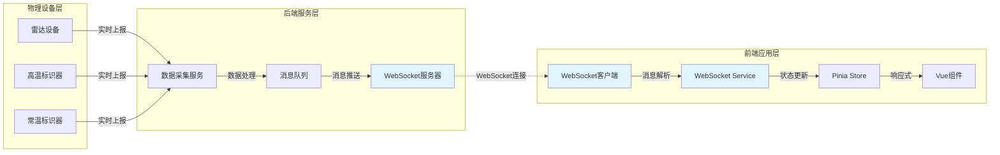

#### 4.1.1 实时数据流说明
1. **物理设备层**: 雷达设备和标识器实时采集数据
2. **后端服务层**: 数据采集、处理、通过 WebSocket 推送
3. **前端应用层**: 接收、解析、存储、展示实时数据
4. **更新频率**:
   - 雷达设备状态: 实时推送（状态变化时）
   - 标识器状态: 实时推送（电量/温度变化时）
   - 心跳检测: 30秒/次

### 4.2 配置数据流（HTTP）

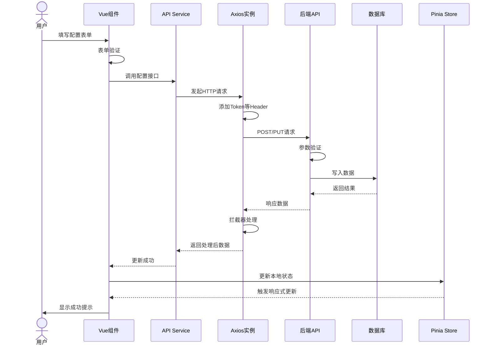

#### 4.2.1 配置数据流说明
1. **用户操作**: 在表单中修改配置
2. **前端验证**: 表单验证规则校验
3. **API 调用**: 封装的 API Service 发起请求
4. **后端处理**: 验证、业务逻辑、数据持久化
5. **状态同步**: 更新 Pinia Store，触发 UI 更新

### 4.3 报表数据流（HTTP）

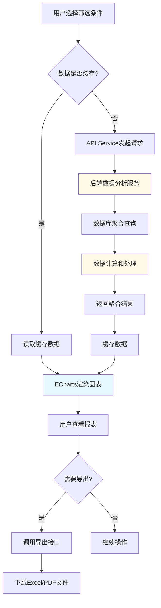

#### 4.3.1 报表数据流说明
1. **筛选条件**: 时间范围、设备、工位等
2. **缓存策略**: 相同条件的数据缓存5分钟
3. **后端聚合**: 数据库层面进行聚合计算
4. **图表渲染**: ECharts 展示统计图表
5. **数据导出**: 支持 Excel/PDF 格式导出

### 4.4 轨迹追踪数据流（WebSocket + HTTP）

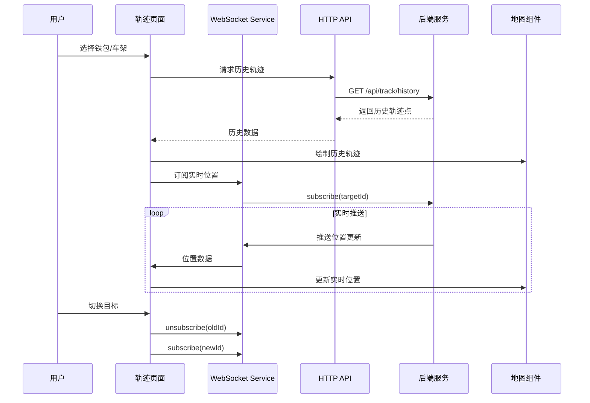

#### 4.4.1 轨迹追踪数据流说明
1. **历史轨迹**: HTTP 接口获取历史轨迹点
2. **实时位置**: WebSocket 订阅实时位置更新
3. **地图展示**: 历史轨迹 + 实时位置叠加显示
4. **订阅管理**: 切换目标时取消旧订阅，建立新订阅

### 4.5 告警处理流程

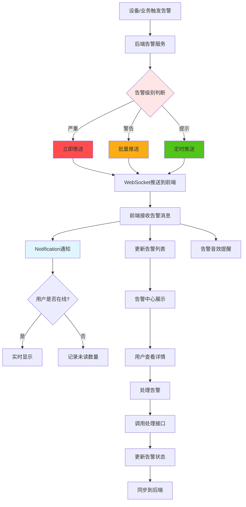

#### 4.5.1 告警处理流程说明
1. **告警触发**: 设备离线、低电量、高温等
2. **告警分级**: 严重、警告、提示三个等级
3. **推送策略**:
   - 严重告警: 立即推送
   - 警告告警: 每30秒批量推送
   - 提示告警: 每5分钟批量推送
4. **用户通知**: Notification + 音效 + 消息中心
5. **告警处理**: 确认、忽略、标记为已读

---

## 5. 技术实现要点

### 5.1 性能优化

#### 5.1.1 大数据量表格
- 使用 Arco Design Table 的虚拟滚动功能
- 分页加载，每页 50 条数据
- 懒加载图片和复杂组件

#### 5.1.2 实时数据更新
- 使用 `requestAnimationFrame` 控制更新频率
- 批量更新，避免频繁触发响应式系统
- 使用 `Object.freeze()` 冻结不需要响应式的大对象

#### 5.1.3 图表性能
- ECharts 按需加载组件
- 大数据量图表使用数据抽样
- 使用 Canvas 模式而非 SVG

### 5.2 错误处理

#### 5.2.1 HTTP 请求错误
```typescript
// src/utils/error-handler.ts
export function handleApiError(error: any): void {
  if (error.response) {
    // 服务器返回错误
    const { status, data } = error.response;
    switch (status) {
      case 401:
        // 未授权，跳转登录
        router.push({ name: 'Login' });
        break;
      case 403:
        Message.error('没有权限访问');
        break;
      case 404:
        Message.error('请求的资源不存在');
        break;
      case 500:
        Message.error('服务器错误');
        break;
      default:
        Message.error(data.message || '请求失败');
    }
  } else if (error.request) {
    // 请求发送失败
    Message.error('网络连接失败');
  } else {
    // 其他错误
    Message.error(error.message || '未知错误');
  }
}
```

#### 5.2.2 WebSocket 错误
```typescript
// WebSocket 连接失败时自动降级
connection.on('error', (error) => {
  autoFallbackService.recordFailure();
  if (!autoFallbackService.shouldUseWebSocket()) {
    // 切换到 HTTP 轮询
    radarStatusPolling.start(handleStatusUpdate);
  }
});
```

### 5.3 安全措施

#### 5.3.1 Token 认证
- HTTP 请求携带 JWT Token
- WebSocket 连接建立时发送 Token 验证
- Token 过期自动刷新

#### 5.3.2 数据加密
- 敏感数据 HTTPS 传输
- WebSocket 使用 WSS 协议

#### 5.3.3 权限控制
- 路由级权限控制
- 按钮级权限控制
- API 级权限验证

---

## 6. 开发计划

### 6.1 第一阶段：基础框架（已完成）
- ✅ 项目初始化
- ✅ 路由配置
- ✅ 基础布局
- ✅ 菜单系统
- ✅ 用户认证

### 6.2 第二阶段：状态监控模块（2周）
- [ ] WebSocket 基础服务封装
- [ ] 雷达设备状态页面
  - WebSocket 实时数据展示
  - 设备状态列表
  - 设备详情弹窗
- [ ] 标识器状态页面
  - WebSocket 实时数据展示
  - 标识器状态列表
  - 低电量告警

### 6.3 第三阶段：配置管理模块（3周）
- [ ] 雷达设备配置
  - CRUD 操作
  - 参数配置表单
  - 批量操作
- [ ] 标识器配置
  - CRUD 操作
  - 绑定管理
  - 批量导入/导出
- [ ] 工位列表
- [ ] 铁包配置
  - 维护记录管理
  - 寿命统计
- [ ] 车架配置
- [ ] 报警配置
  - 规则配置
  - 通知设置

### 6.4 第四阶段：报表分析模块（2周）
- [ ] 雷达识别报表
  - 统计图表
  - 数据筛选
  - 导出功能
- [ ] 标识器寿命报表
  - 寿命分析
  - 更换建议
- [ ] 原始数据表
  - 大数据量表格
  - 高级筛选
  - CSV 导出

### 6.5 第五阶段：轨迹追踪模块（2周）
- [ ] 铁包及车架轨迹
  - 地图集成
  - 实时位置展示
  - 历史轨迹回放
- [ ] 检查点位
  - 点位管理
  - 通过记录
- [ ] 识别率统计
  - 多维度分析
  - 趋势预测

### 6.6 第六阶段：首页仪表盘（1周）
- [ ] 数据概览
  - 关键指标卡片
  - 统计图表
  - 实时告警

### 6.7 第七阶段：优化和测试（1周）
- [ ] 性能优化
- [ ] 兼容性测试
- [ ] 压力测试
- [ ] Bug 修复
- [ ] 文档完善

---

## 7. 接口文档规范

### 7.1 通用约定

#### 7.1.1 请求格式
```
GET /api/module/resource?param1=value1&param2=value2
POST /api/module/resource
PUT /api/module/resource/:id
DELETE /api/module/resource/:id
```

#### 7.1.2 响应格式
```json
{
  "code": 20000,
  "msg": "success",
  "data": { ... },
  "timestamp": 1234567890
}
```

#### 7.1.3 错误码
- 20000: 成功
- 40000: 参数错误
- 40100: 未授权
- 40300: 无权限
- 40400: 资源不存在
- 50000: 服务器错误

### 7.2 分页参数
```typescript
interface PaginationParams {
  page: number; // 页码，从 1 开始
  pageSize: number; // 每页数量，默认 20
  sortBy?: string; // 排序字段
  sortOrder?: 'asc' | 'desc'; // 排序方向
}

interface PaginationResponse<T> {
  total: number; // 总数
  page: number; // 当前页
  pageSize: number; // 每页数量
  list: T[]; // 数据列表
}
```

### 7.3 时间格式
- 统一使用 Unix 时间戳（毫秒）
- 显示时使用 Day.js 格式化

---

## 8. 前后端协作

### 8.1 Mock 数据开发
在后端接口未完成前，前端使用 Mock.js 生成模拟数据：

```typescript
// src/mock/status.ts
import Mock from 'mockjs';

Mock.mock(/\/api\/status\/radar-devices/, 'get', () => {
  return {
    code: 20000,
    msg: 'success',
    data: {
      total: 10,
      list: Mock.mock({
        'list|10': [{
          'deviceId': '@id',
          'deviceName': '雷达设备@natural(1, 10)',
          'status|1': ['online', 'offline', 'warning'],
          'ip': '@ip',
          'port': '@natural(1000, 9999)',
          'signalStrength': '@natural(0, 100)',
          'recognitionCount': '@natural(0, 10000)',
          'lastHeartbeat': '@now',
        }]
      }).list
    }
  };
});
```

### 8.2 接口联调
1. 前端先基于 Mock 数据完成页面开发
2. 后端提供 API 文档（Swagger/Apifox）
3. 前端配置代理，切换到真实接口
4. 联调测试，修复问题

### 8.3 WebSocket 联调
1. 使用 WebSocket 测试工具验证后端推送
2. 前端连接测试环境 WebSocket
3. 验证消息格式和推送频率
4. 测试断线重连机制

---

## 9. 部署方案

### 9.1 环境变量配置

#### 9.1.1 开发环境 (.env.development)
```env
VITE_API_BASE_URL=http://localhost:8080/api
VITE_WS_BASE_URL=ws://localhost:8080
```

#### 9.1.2 生产环境 (.env.production)
```env
VITE_API_BASE_URL=https://api.example.com/api
VITE_WS_BASE_URL=wss://api.example.com
```

### 9.2 构建配置
```bash
# 开发环境
npm run dev

# 构建生产版本
npm run build

# 预览生产构建
npm run preview
```

### 9.3 Nginx 配置
```nginx
server {
    listen 80;
    server_name example.com;

    root /var/www/ilms-frontend/dist;
    index index.html;

    # SPA 路由支持
    location / {
        try_files $uri $uri/ /index.html;
    }

    # API 代理
    location /api {
        proxy_pass http://backend:8080;
        proxy_set_header Host $host;
        proxy_set_header X-Real-IP $remote_addr;
    }

    # WebSocket 代理
    location /ws {
        proxy_pass http://backend:8080;
        proxy_http_version 1.1;
        proxy_set_header Upgrade $http_upgrade;
        proxy_set_header Connection "upgrade";
        proxy_set_header Host $host;
    }
}
```

---

## 10. 技术架构总览

### 10.1 完整技术栈架构图

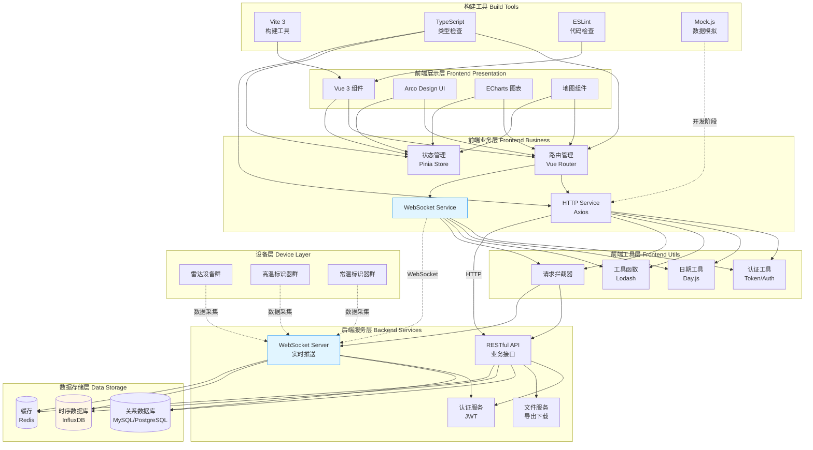

### 10.2 关键技术选型说明

| 技术类别 | 技术选型 | 版本 | 选型理由 |
|---------|---------|------|---------|
| **前端框架** | Vue 3 | 3.2.40 | Composition API、性能优异、生态完善 |
| **类型系统** | TypeScript | 4.8.4 | 类型安全、代码提示、可维护性强 |
| **UI 组件库** | Arco Design Vue | 2.44.7 | 企业级组件、设计优雅、文档完善 |
| **状态管理** | Pinia | 2.0.23 | Vue 3 官方推荐、API 简洁、TypeScript 友好 |
| **路由管理** | Vue Router | 4.0.14 | Vue 官方路由、功能完整 |
| **构建工具** | Vite | 3.2.5 | 启动快速、HMR 体验好、配置简单 |
| **HTTP 客户端** | Axios | 0.24.0 | 功能完整、拦截器支持、易于封装 |
| **实时通信** | WebSocket | 原生API | 浏览器原生支持、实时性好 |
| **图表库** | ECharts | 5.4.0 | 图表类型丰富、性能优秀、文档详细 |
| **日期处理** | Day.js | 1.11.5 | 轻量级、API 友好、Moment.js 替代 |
| **工具库** | Lodash | 4.17.21 | 工具函数完整、性能优化、广泛使用 |

### 10.3 系统部署架构图

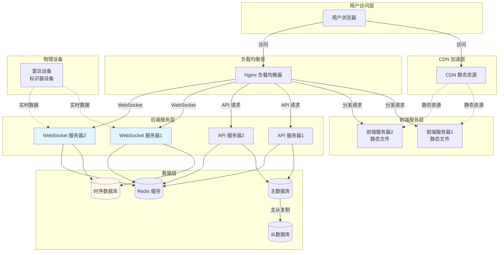

---

## 11. 总结

本系统分析文档详细规划了铁包智能管控系统前端的业务实现方案，主要特点：

1. **实时性保障**: 雷达设备状态和标识器状态采用 WebSocket 实时推送，确保数据实效性
2. **降级方案**: HTTP 轮询作为 WebSocket 的降级方案，保证系统可用性
3. **完整覆盖**: 涵盖状态监控、配置管理、报表分析、轨迹追踪四大核心模块
4. **技术先进**: Vue 3 + TypeScript + Pinia + ECharts 的现代化技术栈
5. **易于维护**: 清晰的代码结构、完善的类型定义、规范的接口文档
